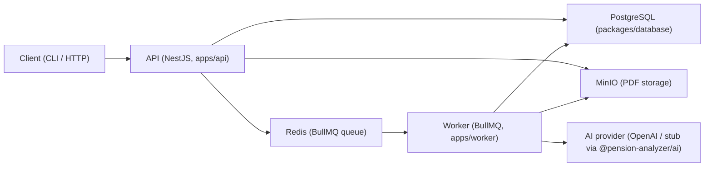
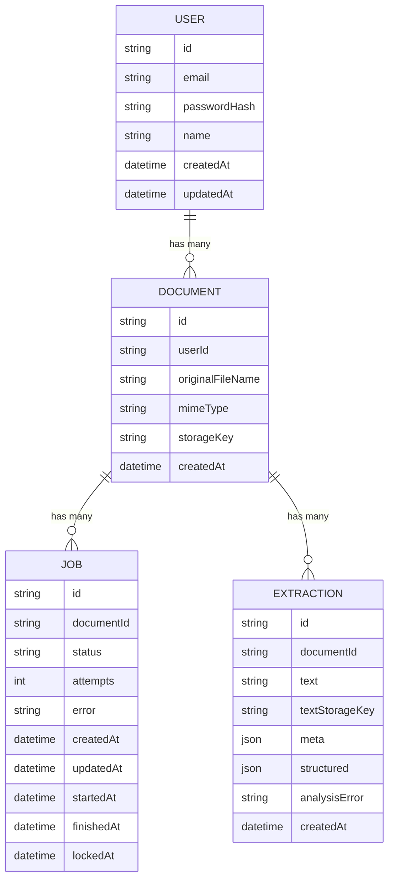
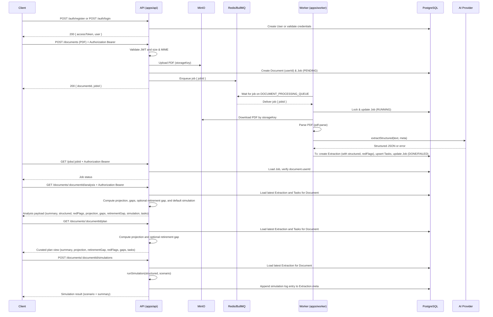

## Pension AI Analyzer – Backend Architecture

This document describes the backend architecture of the Pension AI Analyzer.  
It focuses on the PDF analysis pipeline (upload → storage → queue → worker → AI extraction → persistence → API), not on any end-user UI.

The system is designed so that a client (CLI, script, or HTTP client) authenticates (register/login), then uploads a pension PDF to the API. The API validates and stores the file, associates the document with the authenticated user, enqueues a job in Redis, and a worker process parses the PDF and runs AI-powered structured extraction. Results are written to PostgreSQL and exposed via the API; all document-related endpoints require a valid JWT and return only data owned by that user.

The main external dependencies are:

- **PostgreSQL** – primary relational datastore for documents, jobs, and extractions.
- **Redis** – backing store for BullMQ queues and worker coordination.
- **MinIO** – S3-compatible object storage for raw PDF files (and optionally extracted text).
- **OpenAI / AI provider** – used via `@pension-analyzer/ai` for structured extraction (can be stubbed for local/dev).

### High-Level System Overview

At a high level:

1. A client registers or logs in and receives a JWT (`POST /auth/register`, `POST /auth/login`).
2. The client uploads a pension PDF with the JWT in the `Authorization` header. The API validates the file, stores it in MinIO, creates a `Document` (linked to the user) and `Job` in PostgreSQL, and enqueues a message on a BullMQ queue in Redis.
3. A worker process (`apps/worker`) consumes jobs from the queue, downloads the PDF from MinIO, parses it, and runs AI-backed extraction to produce a structured JSON representation.
4. The worker writes an `Extraction` record to PostgreSQL and marks the `Job` as completed (or failed).
5. The API exposes endpoints for job status, document analysis, tasks, and simulations; all require a valid JWT and return only data for documents owned by the authenticated user.

#### Component diagram (mermaid)

## Components & Packages

### Apps

- **`apps/api` – HTTP API (NestJS)**
  - **Auth:** `AuthModule` provides JWT-based authentication (`POST /auth/register`, `POST /auth/login`, `GET /auth/me`). Protected routes use `JwtAuthGuard`; document, analysis, tasks, and jobs endpoints are scoped to the authenticated user.
  - Exposes endpoints for health checks, document upload, job status, and document analysis (all document-related endpoints require a valid Bearer token).
  - Validates uploads (size, MIME type) using shared constants from `@pension-analyzer/common`.
  - Stores metadata in PostgreSQL via `@pension-analyzer/database`; each `Document` is linked to a `User` via `userId`.
  - Stores PDF files in MinIO.
  - Enqueues document processing jobs to Redis/BullMQ using a shared queue name.

- **`apps/worker` – Document processing worker**
  - Implements a BullMQ `Worker` subscribed to the `DOCUMENT_PROCESSING_QUEUE` from `@pension-analyzer/common`.
  - Resolves the `Job` record in PostgreSQL and safely transitions it to `RUNNING` using a `UPDATE ... WHERE status IN (...) RETURNING` pattern to avoid double-processing.
  - Downloads the PDF from MinIO and parses it using `pdf-parse`.
  - Runs structured extraction via `extractStructured` from `@pension-analyzer/ai`.
  - Creates an `Extraction` record and updates the `Job` to `DONE` or `FAILED` inside a database transaction.

### Shared packages

- **`packages/database` – Prisma schema and client**
  - Defines the PostgreSQL schema in `prisma/schema.prisma`:
    - `User` – user account (email, password hash, optional name); owns documents.
    - `Document` – uploaded file metadata, `userId` (owner), and relationships to `Job` and `Extraction`.
    - `Job` – processing attempts with `JobStatus` enum, attempts, timestamps, and error fields.
    - `Extraction` – AI extraction snapshots (raw text, metadata, structured JSON, and AI error).
  - Exposes a Prisma client and type-safe data access for API and worker.

- **`packages/ai` – AI integration & schema**
  - Contains Zod schemas describing the expected structured extraction output:
    - `PlanEntrySchema` – individual plans/products in a report.
    - `PensionExtractionSchema` – top-level structured extraction for a pension statement.
  - Provides `extractStructured` which abstracts the AI provider:
    - Can use a stub implementation (no external calls, good for local/dev).
    - Can call OpenAI when `AI_PROVIDER=openai` and `OPENAI_API_KEY` is set.

- **`packages/common` – shared constants**
  - `MAX_FILE_SIZE_BYTES` – maximum allowed upload size (10MB).
  - `ALLOWED_MIME_TYPES` – allowable MIME types (currently PDFs only).
  - `DOCUMENT_PROCESSING_QUEUE` – queue name used by both API and worker.

- **`packages/domain` – domain interfaces**
  - TypeScript interfaces that mirror the Prisma models for use at the domain/DTO layer:
    - `User`, `Document`, `Job`, `JobStatus`, `Extraction`, `Task`, etc.
  - Helps decouple higher-level logic from direct ORM types.

- **`infra` – local infrastructure**
  - `infra/docker-compose.yml` defines:
    - `postgres` – PostgreSQL 16 with database `pension_ai`.
    - `redis` – Redis 7 instance for BullMQ.
    - `minio` – MinIO server plus console.
  - Provides named volumes for data persistence in local development.

## Data Model

### Relational schema (Prisma / PostgreSQL)

Defined in `packages/database/prisma/schema.prisma`:

- **`JobStatus` enum**
  - Values: `PENDING`, `RUNNING`, `DONE`, `FAILED`.
  - Tracks the lifecycle of each processing job.

- **`User`**
  - **Fields**:
    - `id: String` – UUID primary key.
    - `email: String` – unique.
    - `passwordHash: String` – bcrypt hash.
    - `name: String?` – optional display name.
    - `createdAt`, `updatedAt: DateTime`.
  - **Relations**:
    - `documents: Document[]` – documents owned by this user.

- **`Document`**
  - **Fields**:
    - `id: String` – UUID primary key.
    - `userId: String` – foreign key to `User` (owner).
    - `originalFileName: String` – original uploaded file name.
    - `mimeType: String` – MIME type (e.g. `application/pdf`).
    - `storageKey: String` – key used to locate the file in MinIO.
    - `createdAt: DateTime` – upload timestamp.
  - **Relations**:
    - `user: User` – owner.
    - `jobs: Job[]` – 1-to-many relationship to `Job`.
    - `extractions: Extraction[]` – 1-to-many relationship to `Extraction`.

- **`Job`**
  - **Fields**:
    - `id: String` – UUID primary key.
    - `documentId: String` – foreign key to `Document`.
    - `status: JobStatus` – current status of the job.
    - `attempts: Int` – number of attempts so far.
    - `error: String?` – last error message, if any.
    - `createdAt: DateTime` – job creation timestamp.
    - `updatedAt: DateTime` – updated automatically (`@updatedAt`).
    - `startedAt: DateTime?` – first time processing started.
    - `finishedAt: DateTime?` – when the job completed (success or failure).
    - `lockedAt: DateTime?` – lock timestamp used to avoid double-processing.
  - **Relations**:
    - `document: Document` – many-to-one relation back to `Document`.

- **`Extraction`**
  - **Fields**:
    - `id: String` – UUID primary key.
    - `documentId: String` – foreign key to `Document`.
    - `text: String` – raw text extracted from the PDF.
    - `textStorageKey: String?` – optional key if raw text is stored in MinIO.
    - `meta: Json?` – arbitrary metadata (e.g. page count).
    - `structured: Json?` – AI-produced structured JSON (`PensionExtraction`).
    - `analysisError: String?` – AI-specific error message, if extraction failed.
    - `createdAt: DateTime` – timestamp when extraction was recorded.
  - **Relations**:
    - `document: Document` – many-to-one relation back to `Document`.

#### ER-style relationships (mermaid)

### AI-level structured schema

Defined via Zod in `packages/ai/src/schema.ts`:

- **Top-level `PensionExtraction`**
  - **Context fields**:
    - `pensionProviderName`, `planType`, `country`, `currency`.
    - `statementDate`, `reportDate`, `vestingDate`.
  - **Aggregate financials**:
    - `totalCurrentSavings`, `totalProjectedSavings`.
    - `currentBalance`.
    - `employeeContributionRate`, `employerContributionRate`.
    - `managementFeePercent`.
  - **Per-plan breakdown**:
    - `plans: PlanEntry[]` – each plan includes:
      - `providerCompany`, `planName`, `productType`, `policyNumber`.
      - `currentBalance`, `projectedBalance`.
      - `managementFeeFromSavingsPercent`, `managementFeeFromPremiumPercent`.
      - `employeeContributionPercent`, `employerContributionPercent`.
      - `status`, `joinDate`.
  - **Investments / funds**:
    - `funds` – array of fund entries with:
      - `name`, `isin`, `allocationPercent`, `managementFeePercent`.
  - **Risk / follow-up pointers**:
    - `thingsToCheck` – list of neutral “things to verify or ask about”, deliberately avoiding financial advice.

The `Extraction.structured` JSON field stores an instance of `PensionExtraction` (or `null` if AI extraction failed or was skipped).

## Processing Flow

### Document upload & job creation (API)

1. **Authentication** – The client obtains a JWT via `POST /auth/register` or `POST /auth/login`, then sends it in the `Authorization: Bearer <token>` header on subsequent requests.
2. **Client upload** – A client sends a `multipart/form-data` `POST` request to the API (e.g. `POST /documents`) with a PDF file and a valid JWT.
3. **Validation** – The API validates:
   - File size against `MAX_FILE_SIZE_BYTES`.
   - MIME type against `ALLOWED_MIME_TYPES` (PDF only).
4. **Storage** – The API:
   - Generates a `storageKey` for the PDF.
   - Uploads the file to MinIO using the configured bucket.
5. **Database write** – The API:
   - Creates a `Document` record with file metadata, `storageKey`, and `userId` (from the JWT).
   - Creates an initial `Job` with `status = PENDING`, `attempts = 0`.
6. **Queue enqueue** – The API enqueues a message on the BullMQ queue (`DOCUMENT_PROCESSING_QUEUE`) containing the `jobId`, backed by Redis.

### Job processing (worker)

1. **Worker startup** – `apps/worker`:
   - Loads configuration from the root `.env`.
   - Creates a BullMQ `Worker` bound to `DOCUMENT_PROCESSING_QUEUE`.
   - Configures a Redis connection based on `REDIS_URL` (default `redis://localhost:6379`).
2. **Job locking** – When a job is received:
   - A raw SQL `UPDATE ... WHERE status IN (PENDING, FAILED) RETURNING ...` sets the job `status` to `RUNNING`, populates `startedAt` (if empty), and sets `lockedAt`.
   - If no row is returned, the job is already in progress or completed.
3. **Document fetch & parsing** – For a locked job:
   - The worker loads the corresponding `Document`.
   - If the document is missing, it marks the job `FAILED` with `error = "Document not found"`.
   - Otherwise, it downloads the PDF from MinIO (bucket and client derived from `MINIO_*` env vars).
   - It uses `pdf-parse` to extract raw text and page count.
4. **AI extraction & analysis** – The worker:
   - Calls `extractStructured({ text, meta: { numPages } })` from `@pension-analyzer/ai`.
   - If the call succeeds and `aiResult.ok` is `true`, it captures `aiResult.result.json` into `structured`.
   - Computes deterministic red flags using `computeRedFlags` from `@pension-analyzer/ai` and builds initial task definitions using `buildTasksFromAnalysis` in `apps/worker`.
   - If the call fails or returns an error, it sets `analysisError` but still keeps the job’s core status aligned with PDF extraction success.
5. **Transaction & status update** – Inside a Prisma transaction:
   - Creates a new `Extraction` with:
     - `documentId`, `text`, `meta.numPages`, `structured`, `analysisError`, and `redFlags`.
   - Upserts canonical `Task` rows for the document using the task definitions.
   - Updates the `Job` to `DONE` with `finishedAt`, increments `attempts`, and clears `error` (unless a hard failure occurred).
6. **Failure handling** – On any hard error (e.g. MinIO, parsing issues), the worker:
   - Marks the `Job` as `FAILED`.
   - Sets `finishedAt`, increments `attempts`, and stores a human-readable `error` message.

### Result retrieval (API)

All document-related endpoints require a valid JWT; the API verifies that the requested document (or job/task) belongs to the authenticated user and returns 404 otherwise.

1. **Auth endpoints** – `POST /auth/register`, `POST /auth/login` (public); `GET /auth/me` (protected). Return `accessToken` and/or user profile.
2. **Job status endpoint** – Clients can query the job via `GET /jobs/:jobId` (with JWT):
   - Returns status (`PENDING`, `RUNNING`, `DONE`, `FAILED`), attempts, timestamps, and error information only if the job’s document belongs to the user.
3. **Document analysis endpoint** – Clients can query the latest analysis via `GET /documents/:documentId/analysis` (with JWT):
   - The API:
     - Loads the latest `Extraction` and related `Task` rows for the document.
     - Derives a short human-readable summary from `structured`.
     - Computes projection and data-completeness gaps using `computeProjection` from `@pension-analyzer/ai`.
     - Optionally computes a retirement gap vs a target monthly pension (using a deterministic calculator in the API).
     - Runs a default simulation scenario using `runSimulation` from `@pension-analyzer/ai` and appends a log entry to `Extraction.meta.simulations`.
   - Returns:
     - Basic `Document` metadata and job information.
     - `hasText` flag indicating that raw text extraction succeeded.
     - The latest `structured` JSON and any `analysisError`.
     - Red flags and counts.
     - Projection summary and projection gaps.
     - Optional retirement gap vs a requested target monthly pension.
     - The latest default simulation result.
     - The current list of tasks for the document from the `Task` table.
4. **Tasks** – `GET /documents/:documentId/tasks`, `PATCH /tasks/:taskId` (with JWT); scoped to the user’s documents.
5. **Idempotency & history** – Multiple extractions can exist per document, but API consumers typically care about the latest `Extraction` (e.g. last successful run after a configuration change).

#### Sequence diagram (upload to result)

## Configuration & Environments

- **Environment files**
  - Root `.env` (see `.env.example`) is shared by `apps/api` and `apps/worker`.
  - Typical variables:
    - `DATABASE_URL` – PostgreSQL connection string used by Prisma (`@pension-analyzer/database`).
    - `REDIS_URL` – Redis connection string for BullMQ (default `redis://localhost:6379`).
    - `MINIO_ENDPOINT`, `MINIO_PORT`, `MINIO_ACCESS_KEY`, `MINIO_SECRET_KEY`, `MINIO_BUCKET` – MinIO connection and bucket configuration.
    - `API_PORT` – port for the NestJS API (default `3000`).
    - `JWT_SECRET` – secret used to sign JWTs (required for auth).
    - `AI_PROVIDER` – `stub` or `openai`.
    - `OPENAI_API_KEY` – required when `AI_PROVIDER=openai`.
    - Optional AI tuning: `AI_MODEL` (default `gpt-4o-mini`), `AI_TEMPERATURE`, `AI_MAX_TOKENS`, `AI_TIMEOUT_MS`.

- **Local infrastructure (`infra/docker-compose.yml`)**
  - **PostgreSQL**
    - Image: `postgres:16`.
    - Database: `pension_ai`, user: `app`, password: `app`.
    - Host port: `5433` (mapped to container `5432`).
  - **Redis**
    - Image: `redis:7`.
    - Host port: `6379`.
  - **MinIO**
    - Image: `minio/minio`.
    - API endpoint: `http://localhost:9000`.
    - Console: `http://localhost:9001`.
    - Access key: `app`, secret key: `appappapp`.

- **Setup & run**
  - See `README.md` for:
    - Starting infra: `cd infra && docker compose up -d`.
    - Installing dependencies: `pnpm install` and `pnpm -r build`.
    - Running migrations: `pnpm run db:migrate`.
    - Starting API: `pnpm --filter @pension-analyzer/api start:dev`.
    - Starting worker: `pnpm --filter @pension-analyzer/worker start:dev`.

## Extensibility & Future Work

- **Adding new extraction fields**
  - Extend `PensionExtractionSchema` (and related nested schemas) in `packages/ai/src/schema.ts` with new fields.
  - Update prompts and provider implementation in `@pension-analyzer/ai` to populate the new fields.
  - Ensure downstream consumers (API DTOs, frontend, reports) handle the new fields gracefully.

- **Additional endpoints or consumers**
  - Add new NestJS modules/controllers under `apps/api` to:
    - Expose alternative views on `Document`, `Job`, and `Extraction` data.
    - Provide aggregation or reporting endpoints (e.g. per-provider statistics).
  - Add additional BullMQ workers or queues for new processing flows (e.g. re-analysis, batch imports).

- **Swapping or extending AI providers**
  - Keep `PensionExtractionSchema` as the stable contract for structured data.
  - Implement new providers behind `extractStructured` (e.g. different OpenAI models or other LLM APIs).
  - Allow selection of provider via environment variables without changing the rest of the system.

For more detailed setup instructions and operational commands, see `README.md`. For schema-level details, refer to `packages/database/prisma/schema.prisma` and `packages/ai/src/schema.ts`.

